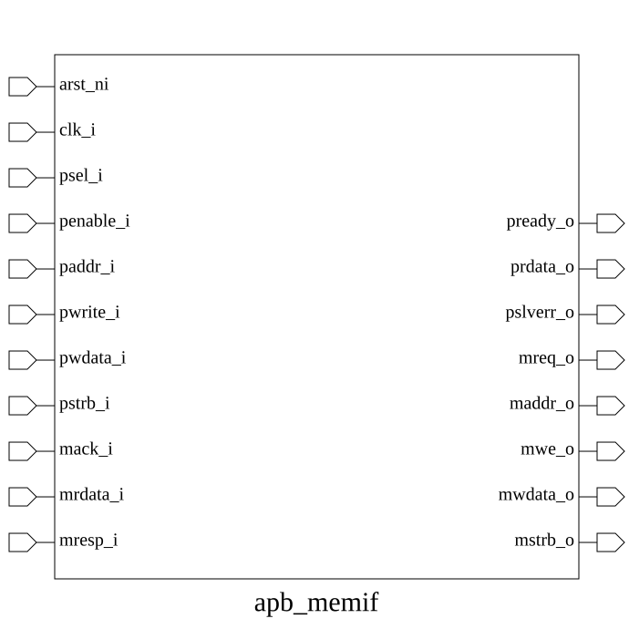

# apb_memif (module)

### Source: apb_memif.sv

## Top IO

## Parameters

|Name|Type|Dimension|Default|Description|
|-|-|-|-|-|
|ADDR_WIDTH|int||32|Parameters for address and data widths|
|DATA_WIDTH|int||32||

## Ports

|Name|Direction|Type|Dimension|Description|
|-|-|-|-|-|
|arst_ni|input|logic||Asynchronous reset, active low|
|clk_i|input|logic||Clock input|
|psel_i|input|logic||Peripheral select|
|penable_i|input|logic||Peripheral enable|
|paddr_i|input|logic [ ADDR_WIDTH-1:0]||Peripheral address|
|pwrite_i|input|logic||Peripheral write enable|
|pwdata_i|input|logic [ DATA_WIDTH-1:0]||Peripheral write data|
|pstrb_i|input|logic [(DATA_WIDTH / 8)-1:0]||Peripheral byte strobe|
|pready_o|output|logic||Peripheral ready|
|prdata_o|output|logic [DATA_WIDTH-1:0]||Peripheral read data|
|pslverr_o|output|logic||Peripheral slave error|
|mreq_o|output|logic||Memory request (asserted on APB access phase start)|
|maddr_o|output|logic [ADDR_WIDTH-1:0]||Memory address|
|mwe_o|output|logic||Memory write enable|
|mwdata_o|output|logic [DATA_WIDTH-1:0]||Memory write data|
|mstrb_o|output|logic [(DATA_WIDTH/8)-1:0]||Memory byte strobe|
|mack_i|input|logic||Memory acknowledge (indicates memory response ready)|
|mrdata_i|input|logic [DATA_WIDTH-1:0]||Memory read data|
|mresp_i|input|logic||Memory response (error indicator)|

## Description

_No top-level description found._
