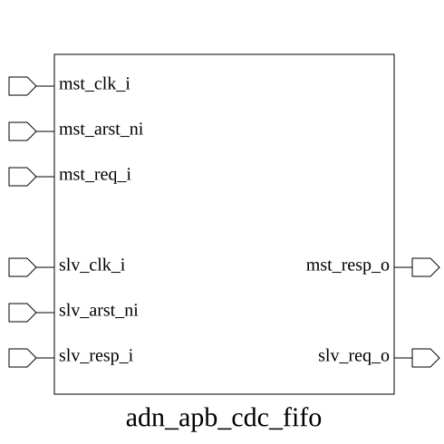
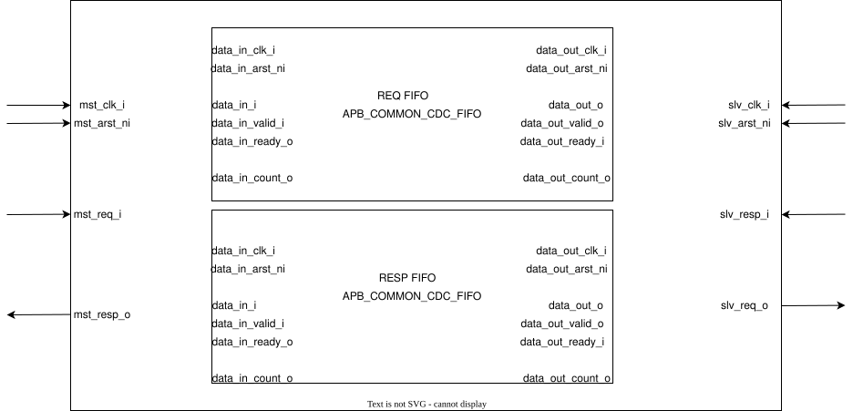

# adn_apb_cdc_fifo (module)

### Author : Annim Jannat (jannatannim@gmail.com)

## TOP IO

## Parameters
|Name|Type|Dimension|Default Value|Description|
|-|-|-|-|-|
|apb_req_t|type||logic|APB request structure type|
|apb_resp_t|type||logic|APB response structure type|
|SYNC_STAGES|int||2|Number of synchronization stages for CDC|

## Ports
|Name|Direction|Type|Dimension|Description|
|-|-|-|-|-|
|mst_clk_i|input|logic||Master clock input|
|mst_arst_ni|input|logic||Master asynchronous reset (active low)|
|mst_req_i|input|apb_req_t||APB request from master|
|mst_resp_o|output|apb_resp_t||APB response to master|
|slv_req_o|output|apb_req_t||APB request to slave|
|slv_clk_i|input|logic||Slave clock input|
|slv_arst_ni|input|logic||Slave asynchronous reset (active low)|
|slv_resp_i|input|apb_resp_t||APB response from slave|
## Description

### Purpose
This module implements an asynchronous FIFO bridge for the APB (Advanced Peripheral Bus) protocol, enabling reliable data transfer between two clock domains (master and slave). It handles clock domain crossing (CDC) synchronization to ensure data integrity and timing closure when the APB master and slave operate on independent clock frequencies.

### Use Case
This module is primarily used in SoC designs where an APB master (e.g., a CPU or DMA controller) needs to communicate with a peripheral residing in a different clock domain. By acting as a bridge, it buffers APB transactions, preventing metastability issues and ensuring that control signals and data remain coherent despite the asynchronous nature of the two clock trees.

| REVISION | DATE       | AUTHOR          | DESCRIPTION                                            |
|----------|------------|-----------------|--------------------------------------------------------|
| 0.1      | 2026-08-04 | Annim Jannat    | Initial version                                        |
| 1.0      | YYYY-MM-DD | Annim Jannat    | Stable release                                         |

This file is part of ADN-VLSI/adn_apb
 **Copyright (c) 2026 ADN Semiconductors**
 **Licensed under the MIT License**
 **See LICENSE file in the project root for full license information**

