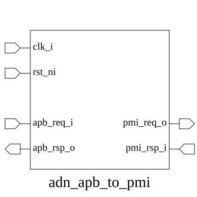

# adn_apb_to_pmi (module)

### Author: Annim Jannat (jannatannim@gmail.com)

### Source: adn_apb_to_pmi.sv

## Top IO

## Parameters

|Name|Type|Dimension|Default|Description|
|-|-|-|-|-|
|apb_req_t|type||logic|`APB_REQ_T`  generated struct|
|apb_rsp_t|type||logic|`APB_RSP_T` generated struct|
|pmi_req_t|type||logic|`PMI_REQ_T`  generated struct|
|pmi_rsp_t|type||logic|`PMI_RSP_T` generated struct|

## Ports

|Name|Direction|Type|Dimension|Description|
|-|-|-|-|-|
|clk_i|input|logic||PORTS ---------------- Global signals ----------------|
|rst_ni|input|logic|||
|apb_req_i|input|apb_req_t||---------------- APB slave port ----------------|
|apb_rsp_o|output|apb_rsp_t|||
|pmi_req_o|output|pmi_req_t||---------------- PMI master port ---------------|
|pmi_rsp_i|input|pmi_rsp_t|||

## Description

This module acts as a bridge between the APB (Advanced Peripheral Bus) and the PMI (Parallel Memory Interface) protocols. It translates APB read/write transactions into PMI requests, managing the handshake signals and state transitions required to ensure data integrity and protocol compliance.

### Use Case
The `adn_apb_to_pmi` module is designed to interface standard APB-compliant peripherals or interconnects with memory-mapped components that utilize the PMI protocol. It is typically used in SoC designs where a control bus (APB) needs to access high-speed memory or custom hardware accelerators that do not natively support APB.

| REVISION | DATE       | AUTHOR          | DESCRIPTION                                            |
|----------|------------|-----------------|--------------------------------------------------------|
| 0.1      | 2026-08-13 | Annim Jannat    | Initial version                                        |
| 1.0      | 2026-08-16 | Annim Jannat    | Stable release                                         |

Author : Annim Jannat (jannatannim@gmail.com)
